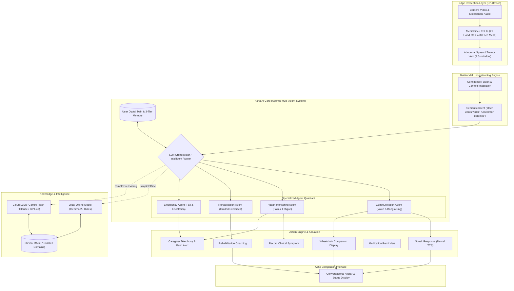

# NeuroBridge Asha Architecture

NeuroBridge Asha is a **multimodal assistive intelligence platform** combining edge computer vision, personalized memory, retrieval-augmented knowledge, agentic AI, and cloud-native language models to transform non-verbal human signals into meaningful communication and proactive assistance.

The platform enforces a strict hybrid boundary:
* **Edge AI:** Instant response (<50 ms), privacy-preserving, zero cloud dependency, 100% offline operational resilience.
* **Cloud AI:** Advanced medical reasoning, deep clinical synthesis, and multi-turn therapy personalization.
* **Agentic Layer:** Closed-loop PEEC (Plan, Execute, Evaluate, Correct) multi-agent goal planning and tool execution.
* **RAG Layer:** Trusted clinical rehabilitation knowledge retrieval grounded in 7 core domains.

> **Safety Notice:** NeuroBridge Asha is an assistive intelligence platform and not a certified medical device. It does not control wheelchair propulsion motors directly.

---

## 1. System Topology & Mermaid Flow



---

## 2. Nine Architectural Pillars

### Layer 1: Edge Perception Layer
* **Dual Hand Tracking:** 21 3D Cartesian coordinates per hand. Identifies micro-flexions, pinches, swipes, and resting configurations.
* **478-Point Face Mesh:**
  - Eye Aspect Ratio (EAR) for voluntary blinks and winks.
  - Mouth Aspect Ratio (MAR) for speech motor attempts.
  - Eyebrow and nasolabial displacement for PAINAD-aligned pain grimacing.
  - Head pose orientation (yaw, pitch, roll) for nods and turns.
* **Temporal Stability:** 2.5s sliding window filters high-frequency tremor and involuntary spasms.

### Layer 2: Multimodal Understanding Engine
Fuses signals across visual, acoustic, and contextual channels into high-level semantic intents (e.g. *"User wants water"*, *"User experiencing acute discomfort"*).

### Layer 3: User Digital Twin
Each patient has a structured Digital Twin profile:
```json
{
  "user_name": "Rahim",
  "clinical_condition": "Stroke Recovery (Left Hemiparesis)",
  "communication_modality": "Right hand micro-gestures & eye-blink scanning",
  "primary_language": "Bangla",
  "voice_preference": "Female (Reassuring)",
  "common_requests": ["Water", "Pain", "Call daughter"],
  "rehab_exercises": ["Neck lateral movement", "Active-assisted hand stretching"],
  "risk_flags": { "fall_detection": true, "aspiration_precautions": true }
}
```

### Layer 4: Three-Tier Memory Architecture
1. **Short-term Memory:** Active conversation rolling buffer (10–30s).
2. **Long-term Relational Memory:** Persistent PostgreSQL (cloud) and encrypted local storage (device) for medical profiles, preferences, and caregiver grants.
3. **Semantic Vector Memory:** Vector database indexing past clinical sessions, exercise adherence, and personalized vocabulary.

### Layer 5: Seven-Domain Clinical RAG Augmentation
Curated clinical knowledge base covering:
1. `stroke_rehabilitation`: Motor relearning, hemiparesis recovery, neuroplasticity.
2. `speech_therapy`: Oral-motor drills, dysarthria pacing, phoneme guidance.
3. `autism_support`: Visual schedules, low-arousal AAC, sensory calming.
4. `icu_communication`: Intubation boards, eye-gaze confirmation, pain scales.
5. `physiotherapy`: Range of motion, contracture prevention, spasticity management.
6. `caregiver_guidelines`: Transfer mechanics, pressure injury offloading, burnout prevention.
7. `user_specific_instructions`: Individualized care directives, dietary modifications.

### Layer 6: Specialized Agent Quadrant
* **Communication Agent:** Natural conversation, phrase completion, English-to-Bangla translation.
* **Health Monitoring Agent:** Detects pain expressions, fatigue trends, and abnormal rhythmic jerking.
* **Rehabilitation Agent:** Guides step-by-step physical and speech therapy:
  > *"Let's move your neck slowly. Turn right... Good. Now slightly more... Excellent."*
* **Emergency Agent:** Multi-step autonomous escalation:
  $$\text{Abnormal Event} \longrightarrow \text{Prompt User} \xrightarrow{\text{No Response}} \text{Call Caregiver} \longrightarrow \text{Dispatch Alert}$$

### Layer 7: Intelligent LLM Router
* Simple tasks & offline mode $\rightarrow$ Local deterministic engine / Gemma 2.
* Complex medical inquiries & deep conversation $\rightarrow$ Gemini Flash / Claude / GPT-4o.
* Automatic fallback: When offline, Asha never crashes; the local agent provides immediate assistance.

### Layer 8: Action Engine
Concrete executable actions:
* `speak_voice_response`: Generates vocalized output.
* `start_rehabilitation_exercise`: Initiates guided exercise routines.
* `call_caregiver`: Direct urgent telephone/VoIP alert.
* `send_wheelchair_caption`: Transmits text to the wheelchair display.
* `trigger_caregiver_alert`: Sends structured push notifications.
* `record_symptom_log`: Logs pain, spasms, or fatigue to medical records.
* `remind_medication`: Tracks medication schedule adherence.

### Layer 9: Asha Companion Interface
Warm, reassuring companion avatar combining real-time facial feedback, synthesized voice, and proactive care prompts (*"I noticed you look uncomfortable. Would you like me to call your caregiver?"*).

---

## 3. Releases and Deployments

| Deliverable | Platform | Link |
|:---|:---|:---|
| **Patient Android APK** | Android | [android-patient-v3.0.0](https://github.com/mysunatislam/NeuroBridge-Asha/releases/tag/android-patient-v3.0.0) |
| **Caregiver Android APK** | Android | [android-caregiver-v3.0.0](https://github.com/mysunatislam/NeuroBridge-Asha/releases/tag/android-caregiver-v3.0.0) |
| **Patient iOS IPA** | iOS (Unsigned) | [ios-patient-v3.0.0](https://github.com/mysunatislam/NeuroBridge-Asha/releases/tag/ios-patient-v3.0.0) |
| **Caregiver iOS IPA** | iOS (Unsigned) | [ios-caregiver-v3.0.0](https://github.com/mysunatislam/NeuroBridge-Asha/releases/tag/ios-caregiver-v3.0.0) |
| **Patient Web PWA** | Web | [https://mysunatislam.github.io/neurobridge-asha-patient/](https://mysunatislam.github.io/neurobridge-asha-patient/) |
| **Caregiver Web Portal** | Web | [https://mysunatislam.github.io/neurobridge-asha-caregiver/](https://mysunatislam.github.io/neurobridge-asha-caregiver/) |
