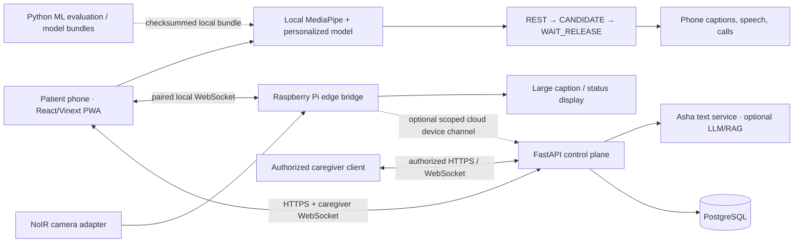

# Architecture

FingerSpeak separates local assistive communication, wheelchair hardware, conversation AI, and
caregiver connectivity. Network loss must not disable the browser's confirmed gesture phrases,
local captions, local speech playback, saved contacts, or backup AAC pathway. Cloud Asha, remote
caregiver delivery, and cloud device presence are optional capabilities.

FingerSpeak is not a validated medical device or emergency service, and no component may control
wheelchair propulsion or execute arbitrary Raspberry Pi commands.

## Runtime responsibilities

### Patient application — `apps/web`

The primary frontend is the React 19/Vinext PWA. One application provides four deliberately
different surfaces:

- **Patient:** reassuring Asha conversation, typed and optional user-initiated voice input, local
  SpeechSynthesis playback, explicit phone-call handoff, confirmed help action, quick phrases, and
  the existing gesture-recognition path.
- **Pi Display:** large dynamic caption plus tracking, camera, phone-link, Pi power, and wheelchair
  battery indicators. It contains no phone-style conversation audio controls.
- **Caregiver:** confirmed activity and alerts, honest patient/Pi connectivity, separate Pi power
  and wheelchair battery values, and simple call/message actions. Pairing, grants, consent, and
  model-quality controls are secondary advanced settings.
- **Setup:** personalized gesture calibration and validated model/profile import.

MediaPipe WASM and the hand model are bundled. IndexedDB stores the local profile, calibration
samples, active model, consent guard, outbox, remote link, and phone contacts. The service worker
caches only the application shell and versioned static assets; API, authentication, profile, Asha,
and other user-specific responses remain network-only.

The current personalized gesture classifier runs in the browser and does not consume a Raspberry
Pi video stream. Moving that classifier to the Pi requires a separate validated local-inference
adapter. It must not be implemented by uploading camera frames to the API.

### Raspberry Pi edge — `services/edge`

The edge package runs beside the NoIR camera and wheelchair display. Its current responsibilities
are camera lifecycle/capture adapter control, caption/emergency display state, telemetry, phone
presence, pairing, and bounded command handling. A simulator makes the same state machine testable
without Pi hardware.

The edge service has no LLM key, cloud prompt logic, media-upload route, shell-command message, or
wheelchair motor interface. `pi_battery_percent` and `wheelchair_battery_percent` stay `null` until
dedicated validated sensors provide them; the UI renders `Unknown`, never an invented percentage or
zero.

### FastAPI control plane — `services/api`

The API owns accounts/gateway identity, profile ownership, caregiver grants, consent enforcement,
usage sessions, derived events, model metadata, durable caregiver alerts, Asha text requests, and
optional registered-device state. PostgreSQL provides durable storage and Alembic owns migrations.

Camera frames, audio, landmarks, feature vectors, and calibration sequences are not accepted. The
API middleware rejects image, video, multipart, and binary bodies. Confirmed derived events sync
only after consent; routine local speech does not depend on the API.

### ML package — `services/ml`

The Python package provides the browser-parity 20×63 → 20×98 feature pipeline, augmentation,
session-aware splits, baselines, OOD evaluation, optional TensorFlow export, and checksummed model
bundles. Browser activation verifies artifact checksums, feature dimensions, gesture IDs/order,
profile fingerprint, confidence threshold, and safety metadata before replacing a local model.

`apps/web-vue` remains a legacy/reference presentation layer and is not exercised by the primary
bootstrap, Compose, or CI frontend jobs.

## Asha boundary

`POST /v1/asha/chat` is an authenticated, bounded, text-only API. The browser sends a message,
locale, and bounded patient-owned context including a short recent summary. The response contains reply
text, mode, optional citations and response ID, and an urgent flag.

When `OPENAI_API_KEY` is configured on the API server, the service can call the OpenAI Responses
API. `FINGERSPEAK_OPENAI_VECTOR_STORE_ID` enables owner-scoped file search; retrieved files are
filtered to the authorized profile. Requests use bounded timeout/output and `store=false`. The API
returns a deterministic offline companion response when the provider is missing or unavailable.

Documents enter the configured vector store only through a separate, consented administration
workflow and must carry a `profile_id` attribute matching the authorized FingerSpeak profile. The
runtime API deliberately exposes no general medical-document upload route.

No OpenAI credential is placed in a `NEXT_PUBLIC_*` value, browser storage, Pi configuration, or
WebSocket message. An Asha urgent classification never calls someone, sends an emergency alert, or
changes the Pi display by itself; the patient must confirm the corresponding action.

## Raspberry Pi connectivity

FingerSpeak has two distinct device links:

1. **Direct local phone-to-Pi link.** The normative protocol is
   [DEVICE_PROTOCOL.md](DEVICE_PROTOCOL.md). Browser WebSockets cannot set an Authorization header,
   so credentials are never placed in a URL query. The first strict message authenticates a
   one-time pairing code or device credential. No status is trusted before authentication. The
   protocol carries heartbeat, status, caption, emergency-display, acknowledgement, and telemetry
   JSON only—never camera frames.
2. **Optional Pi-to-cloud link.** Owners may register a device through `/v1/devices`; the API returns
   a scoped bearer token once and retains only its digest. The cloud socket accepts strict text JSON
   telemetry/acknowledgements and enables authorized remote status and short-lived caption queues.
   It does not replace direct local pairing or prove the patient's phone is reachable.

The preferred prototype network is the patient's phone hotspot. USB tethering is the cable fallback
because it preserves the same IP/WebSocket contract. Plain `ws://` is limited to controlled
prototype networks; production requires `wss://` or another platform-supported local-network
security design.

## Caregiver and emergency semantics

Caregiver alerts are committed before best-effort WebSocket fan-out and replayed after reconnect.
Revoking a caregiver grant closes that actor's sockets; withdrawing caregiver-alert consent closes
all caregiver sockets for the profile. Multi-replica deployments must broadcast committed alerts,
device events, and revocations through shared pub/sub.

WebSockets, Asha, inferred presence, phone dialer handoff, and Pi captions are convenience channels,
not guaranteed emergency delivery. Emergency phrases require an explicit dwell/touch confirmation,
and an active emergency display has priority over routine captions. A tested independent call or AAC
method must remain available.

## Identity and trust boundaries

Development/test may use an unsigned `X-Actor-Subject` identity handoff when explicitly enabled.
Staging and production reject it unless an OIDC/session-aware gateway first removes all
client-supplied `X-Actor-*` headers and injects:

- `X-Actor-Subject`: the stable subject from the validated user credential;
- `X-Actor-Timestamp`: the gateway's current Unix time in seconds; and
- `X-Actor-Signature`: `v1=` plus the lowercase HMAC-SHA256 digest.

The HMAC input is compact, sorted-key UTF-8 JSON containing exactly `method`, `path`, `subject`,
`timestamp`, and `version`. WebSocket upgrades use method `GET`. The API compares the digest in
constant time and rejects timestamps outside `FINGERSPEAK_GATEWAY_SIGNATURE_TTL_SECONDS`.
Staging/production require a secret of at least 32 bytes. Browsers never receive or construct the
shared signature secret.

Credentialed HTTP and WebSocket origins must exactly match `FINGERSPEAK_CORS_ORIGINS`. The direct
Pi pairing code/device credential and cloud device bearer token are separate credentials with
separate scopes; neither is an API user session or LLM credential.
