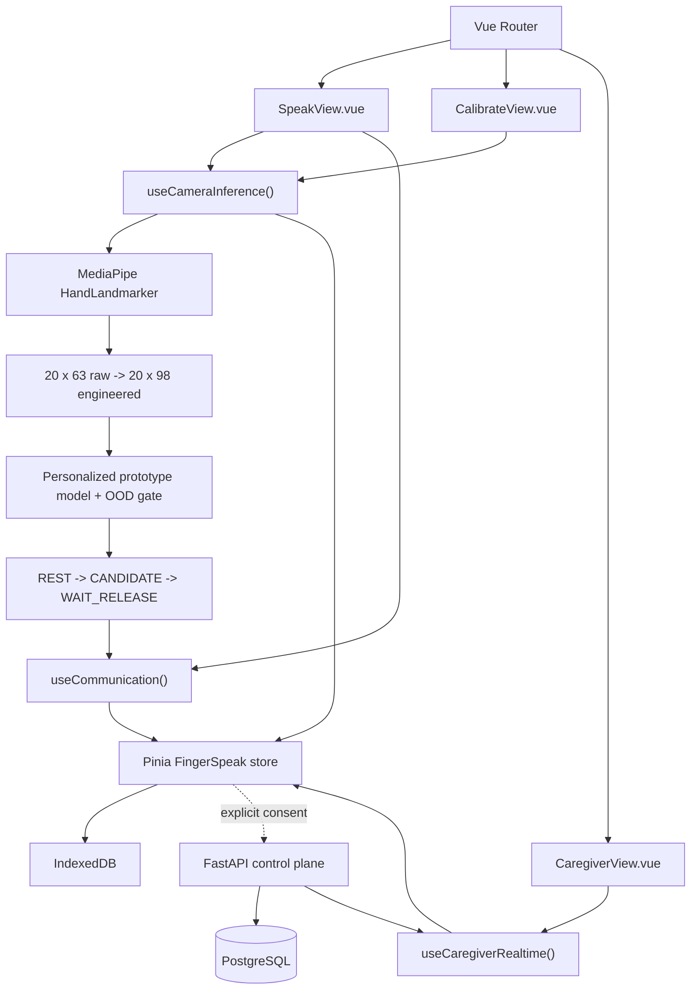

# FingerSpeak Vue frontend architecture

## Goal

Vue is the presentation and orchestration layer, not the recognition model. FingerSpeak keeps its local-first safety path intact while using Vue to make the application modular, reactive, and easier to extend into a multi-role product.

## Stack

- **Vue 3.5** — Single-File Components and `<script setup lang="ts">`
- **Pinia** — shared application state and typed actions
- **Vue Router 5** — lazy-loaded Speak, Calibrate, and Caregiver workspaces
- **Vite 8** — development/build pipeline
- **MediaPipe Tasks Vision** — browser-local hand landmark detection
- **Web Speech API** — verified local voice output when available
- **IndexedDB** — profiles, edge model, outbox, consent guard, and remote link
- **FastAPI + PostgreSQL** — optional control plane
- **WebSocket** — authorized caregiver alert stream with durable API replay

## Component and state flow

## Advanced Vue patterns used

### 1. Route-level domain boundaries

Each user mode is a lazy-loaded route. Speak does not own caregiver networking, and Caregiver does not own camera inference. This prevents one giant component from becoming the product architecture.

### 2. Composables for hardware and side effects

`useCameraInference()` owns media-device permission, MediaPipe lifecycle, animation-frame inference, calibration capture, prediction, and intent confirmation. `useCommunication()` owns local speech and emergency touch arming. `useCaregiverRealtime()` owns WebSocket connection/reconnect and durable alert replay.

### 3. Pinia as an application state layer

The store holds state that must survive route changes or be shared across roles: active profile, active model, consent settings, API availability, remote profile link, recent spoken events, and quality counters. Device persistence remains in IndexedDB rather than being hidden inside Pinia.

### 4. Preserved ML and safety contracts

The Vue migration reuses the TypeScript feature extraction, OOD logic, intent machine, storage layer, API client, and checksummed bundle verifier. This makes the frontend migration low-risk: framework code can change without changing model inputs or activation rules.

### 5. Offline-first PWA shell

The service worker pins the MediaPipe WASM/runtime assets and hand-landmarker model, caches hashed Vite assets, and uses the app shell as the offline fallback for Vue Router navigation. API/auth responses are never cached by the service worker.

### 6. Progressive backend integration

The real-time communication path does not depend on the network. Vue can show cloud status, flush consented derived-event outboxes, and receive caregiver alerts while local recognition and speech continue independently.

## Presentation line

> “Vue.js is not used only for the interface. We use Vue 3 as the orchestration layer around an on-device computer-vision pipeline: Pinia manages shared patient/model state, Composition API composables isolate camera inference and real-time caregiver logic, and Vue Router separates the patient, calibration, and caregiver workflows. The ML path remains local and framework-independent.”
